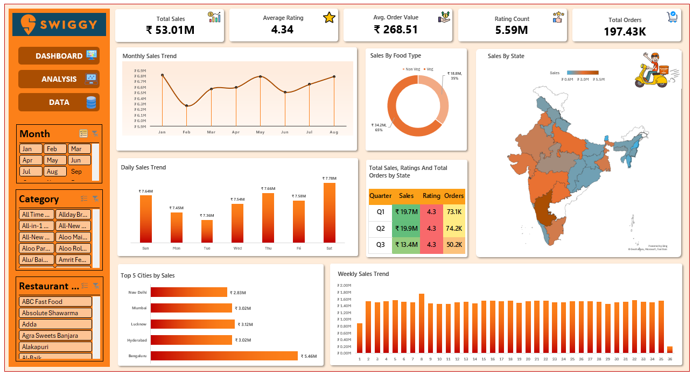

# 🍽️ Swiggy Sales & Restaurant Analytics Dashboard

An interactive **Swiggy Sales & Restaurant Analytics Dashboard developed entirely in Microsoft Excel**. The project analyzes sales performance, customer ratings, order records, food types, cities, states, restaurants, and time-based sales trends.

The dashboard transforms raw Swiggy restaurant data into an interactive business intelligence report using **Excel data analysis, PivotTables, charts, formulas, and interactive filters**.

---

## 📊 Dashboard Preview



---

## 🎯 Project Objective

The objective of this project is to analyze Swiggy's sales and restaurant data and convert it into meaningful business insights through an interactive Excel dashboard.

The dashboard helps answer questions such as:

* How are sales changing over time?
* Which states generate the highest sales?
* Which cities are the top contributors to revenue?
* How does Veg vs Non-Veg sales compare?
* Which days of the week generate the highest sales?
* How does sales performance vary by quarter?
* What is the average customer rating?
* What is the average order value?
* Which categories and restaurants contribute to overall performance?

---

## 🗂️ Dataset

The original dataset is stored in the **`Swiggy Data`** worksheet and contains **197,430 records**.

### Dataset Columns

| Column          | Description                             |
| --------------- | --------------------------------------- |
| State           | State where the restaurant is located   |
| City            | City where the restaurant is located    |
| Order Date      | Date of the order                       |
| Restaurant Name | Name of the restaurant                  |
| Location        | Restaurant location                     |
| Category        | Food/category classification            |
| Dish Name       | Name of the dish                        |
| Price (INR)     | Price of the dish                       |
| Rating          | Customer rating                         |
| Rating Count    | Number of ratings                       |

---

## 📈 Key Performance Indicators

The dashboard provides the following major KPIs:

| KPI                    |   Value |
| ---------------------- | ------: |
| 💰 Total Sales         | ₹53.01M |
| ⭐ Average Rating       |    4.34 |
| 🧾 Average Order Value | ₹268.51 |
| 👍 Rating Count        |   5.59M |
| 📦 Order Records       | 197.43K |

---

## 📊 Dashboard Features

### 1. Monthly Sales Trend

Tracks sales performance from **January to August** and helps identify monthly fluctuations and overall sales patterns.

### 2. Daily Sales Analysis

Compares sales across the seven days of the week to identify high-performing and low-performing days.

### 3. Weekly Sales Trend

Visualizes sales performance across individual weeks to identify weekly fluctuations and peak periods.

### 4. Sales by Food Type

Compares sales generated by:

* Veg
* Non Veg

The analysis shows that Veg food contributes approximately **65% of total sales**, while Non Veg contributes approximately **35%**.

### 5. State-wise Sales Analysis

Analyzes sales across different Indian states using a geographical map visualization.

### 6. Top 5 Cities by Sales

Highlights the highest-performing cities based on sales.

The top cities in the analysis include:

1. Bengaluru
2. Lucknow
3. Hyderabad
4. Mumbai
5. New Delhi

### 7. Quarterly Analysis

Compares sales, average ratings, and order records across quarters.

### 8. Interactive Filters

The dashboard includes interactive filtering options for:

* Month
* Category
* Restaurant Name

These filters allow users to dynamically explore different parts of the dataset.

---

## 🔍 Key Insights

### 💰 Overall Performance

The dataset records approximately **₹53.01 million in total sales** across **197,430 order records**.

### 🥗 Food Type

Veg items account for approximately **65% of total sales**, making them the larger contributor compared with Non Veg items.

### 🏙️ City Performance

**Bengaluru** is the highest-performing city in the analysis, generating approximately **₹5.46 million** in sales.

### 📅 Daily Performance

Saturday records the highest daily sales at approximately **₹7.78 million**, while Tuesday records the lowest at approximately **₹7.36 million**.

### 📆 Quarterly Performance

Q2 generates the highest sales among the analyzed quarters, contributing approximately **₹19.90 million**.

### ⭐ Customer Ratings

The overall average rating is approximately **4.34**, indicating a strong average customer rating across the dataset.

---

## 🛠️ Tools & Technologies

* **Microsoft Excel**
* Excel Tables
* PivotTables
* Pivot Charts
* Excel Formulas
* Data Cleaning
* Data Transformation
* Data Analysis
* Interactive Filters / Slicers
* Dashboard Design
* Data Visualization

---

## ⚙️ Data Preparation & Analysis

Additional analytical fields were derived from the original dataset to support the dashboard, including:

* Day of Week
* Quarter
* Week Number
* Food Type

The **Food Type** classification was derived from dish names by identifying food-related keywords and categorizing records into **Veg** and **Non Veg**.

The processed data was then used to generate the analytical summaries and visualizations presented in the dashboard.

---

## 📁 Project Structure

```text
Swiggy-Sales-Analysis-Excel/
│
├── data/
│   └── swiggy_sample.csv
│
├── excel/
│   └── Swiggy_Sales_Analysis.xlsx
│
├── screenshots/
│   └── dashboard.png
│
└── README.md
```

---

## 🚀 How to Use

1. Download the Excel workbook from the `excel` folder.
2. Open `Swiggy_Sales_Analysis.xlsx` in Microsoft Excel.
3. Navigate to the **Dashboard** worksheet.
4. Use the available filters to explore the data.
5. Interact with the charts and dashboard elements to analyze sales performance.

---

## 📌 Project Highlights

* Analyzed **197K+ Swiggy records**
* Built an interactive Excel dashboard
* Created KPI cards for sales, ratings, AOV, rating count, and orders
* Performed monthly, weekly, daily, and quarterly analysis
* Performed state-wise and city-wise sales analysis
* Compared Veg and Non Veg sales
* Created Top 5 city analysis
* Added interactive dashboard filters
* Converted raw data into a business-oriented analytical dashboard

---

## 👩‍💻 Author

**Avanee Patel**

**B.Sc. Data Science**

---

## ⭐ If You Find This Project Useful

Feel free to explore the workbook, review the dashboard, and use the project as a reference for Excel-based data analytics and dashboard development.
